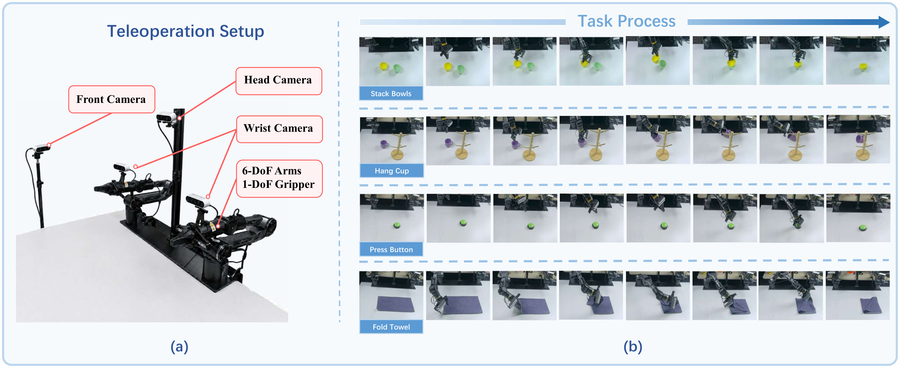

<div align="center">

# RoboNever

### A Real-World Robotic Dataset for Continual Learning

<p align="center">
  <a href="https://arxiv.org/abs/2605.26820"></a>&nbsp;
  <a href="LICENSE"></a>&nbsp;
  <a href="https://www.python.org/downloads/"></a>&nbsp;
  <a href="https://huggingface.co/datasets?search=cl-piper-single"></a>
</p>

---

**RoboNever** is a high-quality real-world robotic dataset designed for studying **continual learning** in vision-language-action (VLA) models.



**Paper**: [Can VLA Models Learn from Real-World Data Continually without Forgetting?](https://arxiv.org/abs/2605.26820)

</div>

---

## Highlights

- **Real Robot Data**: 2,000 episodes collected on a Piper dual-arm robot
- **4 Diverse Tasks**: Rigid manipulation, articulated objects, deformable objects, contact-rich tasks
- **Multi-View Cameras**: 4 synchronized camera views per episode
- **LeRobot Format**: Ready-to-use with the HuggingFace LeRobot library
- **Continual Learning**: Specifically designed for studying catastrophic forgetting

---

## Dataset Overview

<div align="center">

| Task | Episodes | Frames | Description | Type | Download |
|:----:|:--------:|:------:|:-----------:|:----:|:--------:|
| **Stack Bowls** | 500 | 129,612 | Pick and stack bowls | Rigid | [Download](https://huggingface.co/datasets/Ray0v0/cl-piper-single-stack-bowls) |
| **Hang Cup** | 500 | 149,372 | Hang a cup on a rack | Articulated | [Download](https://huggingface.co/datasets/Ray0v0/cl-piper-single-hang-cup) |
| **Fold Towel** | 500 | 213,047 | Fold a deformable towel | Deformable | [Download](https://huggingface.co/datasets/Ray0v0/cl-piper-single-fold-towel) |
| **Press Button** | 500 | 67,955 | Press a button with precision | Contact-rich | [Download](https://huggingface.co/datasets/Ray0v0/cl-piper-single-press-button) |

</div>

---

## Quick Start

### 1. Install Dependencies

```bash
pip install lerobot huggingface_hub
```

### 2. Load a Dataset

```python
from lerobot.common.datasets.lerobot_dataset import LeRobotDataset

# Load any of the 4 tasks
ds = LeRobotDataset("Ray0v0/cl-piper-single-stack-bowls")

print(f"Episodes: {ds.num_episodes}")
print(f"Total Frames: {len(ds)}")
print(f"Sample keys: {ds[0].keys()}")
```

### 3. Download All Datasets

```bash
# Login to HuggingFace (required for download)
huggingface-cli login

# Download all 4 tasks
for task in stack-bowls hang-cup fold-towel press-button; do
    huggingface-cli download "Ray0v0/cl-piper-single-${task}" \
        --repo-type dataset \
        --local-dir "./data/cl-piper-single-${task}"
done
```

---

## Data Specifications

- **Robot**: Piper Dual-Arm, 14-DOF (6 joints + 1 gripper per arm)
- **Cameras**: 4 synchronized views (head, left_wrist, right_wrist, front_view), 480x640 resolution
- **FPS**: 30
- **Format**: H.264 video, Parquet for state/action, MP4 for videos

---

## Dataset Structure

```
cl-piper-single-<task>/
|-- data/
|   +-- chunk-000/
|       |-- episode_000000.parquet
|       |-- episode_000001.parquet
|       +-- ... (500 episodes)
|-- meta/
|   |-- info.json              # Dataset metadata
|   |-- episodes.jsonl         # Episode-level info
|   |-- episodes_stats.jsonl   # Per-episode statistics
|   |-- tasks.jsonl            # Task descriptions
|   +-- modality.json          # Feature mappings
+-- videos/
    +-- chunk-000/
        |-- observation.images.head/
        |-- observation.images.left_wrist/
        |-- observation.images.right_wrist/
        +-- observation.images.front_view/
```

---

## Task Instructions

Each task comes with a natural language instruction for the robot:

<div align="center">

| Task | Language Instruction |
|:----:|:-------------------:|
| Stack Bowls | *"stack the yellow bowl on the green bowl"* |
| Hang Cup | *"hang the purple cup on the mug rack"* |
| Fold Towel | *"fold the grey towel"* |
| Press Button | *"press the green button"* |

</div>

---

## Integration with ContinualVLA

This dataset is designed to work seamlessly with the [ContinualVLA](https://github.com/Agentic-Intelligence-Lab/ContinualVLA) codebase for continual learning experiments:

```bash
# Clone ContinualVLA
git clone https://github.com/Agentic-Intelligence-Lab/ContinualVLA.git
cd ContinualVLA

# Download datasets
export OPENPI_DATA_ROOT="./data"
bash scripts/download_dataset.sh

# Run continual learning training
bash scripts/train_cl.sh
```

---

## Citation

If you find this dataset useful for your research, please cite:

```bibtex
@article{zhu2026continualvla,
  title={Can VLA Models Learn from Real-World Data Continually without Forgetting?},
  author={Zhu, Jiarun and Hong, Yijun and Sun, Xiaoquan and Xu, Zetian and
          Yuan, Mingqi and Wang, Zhiyong and Zeng, Wenjun and Chen, Jiayu},
  journal={arXiv preprint arXiv:2605.26820},
  year={2026}
}
```

---

## License

This dataset is released under the [MIT License](LICENSE).

---

## Related Projects

<div align="center">

| Project | Description |
|:-------:|:-----------:|
| [**ContinualVLA**](https://github.com/Agentic-Intelligence-Lab/ContinualVLA) | Official implementation for continual learning experiments |
| [**openpi**](https://github.com/Physical-Intelligence/openpi) | Base codebase by Physical Intelligence |
| [**LeRobot**](https://github.com/huggingface/lerobot) | HuggingFace's robot learning library |

</div>

---

<div align="center">

**Built by [Agentic Intelligence Lab](https://agentic-intelligence-lab.org/) at The University of Hong Kong**

</div>
